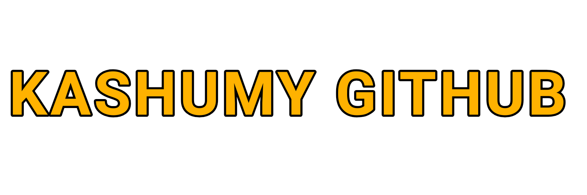
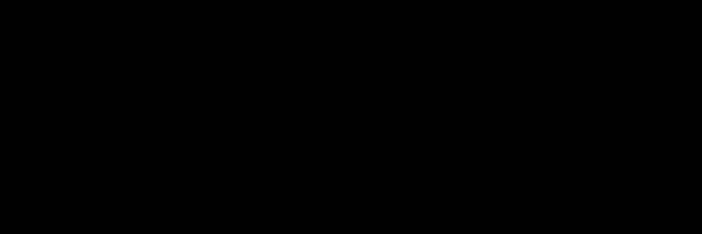

## dayly splash text
- `Lorem dolor sit amet `

  

# Hello My name is Krystian ✨
### Im interested 
- Html 
- Css
- Js
- C++
## ⚙️ My projects 

#### https://wenglon.github.io 
-----------------
^ the best game i ever made
## Join To ByteBinUtils language 
-----------------
[https://github.com/Kashumy/ByteBinUtils](ByteBinUtils_For_Js_Free_to_Use)

### Aplications 

https://kashumy.github.io/My_aplications/Index.html 
### Newly added 🙂
- https://kashumy.github.io/Response/
- ... 
### ✨ Beta projects

- https://kashumy.github.io/JUST_WAIT_FOR_NEW_PROJECT/ 
### 📌 About Me
- 🌐 I like programming in html, css, js. 
- 🥝 I like making games for mobile devices.
- 💻 I create websites and mobile applications
- 🌍 I want to learn how github works and how to create complete css pages
- 🍉 I like watermelon's and kebab's
- ▶️ QA
_________
I learned programming in school because I was inspired to do it by a computer science teacher. This is how I developed my knowledge myself and I learned something from my friend who is named on github @codinger-cutie he was the one who inspired me to put stuff on github 
_________

### 🎉 2022 y. / 📈 2023 y. 

### ^ w ^  meow i like staring nice front-end pages :)

🌟 Motivate my work with stars! 🌟

Hey there! I wanted to share a quick and enjoyable text with you, spiced up with some emojis. Here it goes:

"✨ Help me stay motivated! Your support means the world to me. Let's light up the sky together! ⭐️"

Short, sweet, and hopefully more enjoyable with those sparkly emojis! Remember, your encouragement truly brightens my day!
